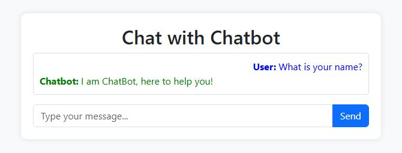
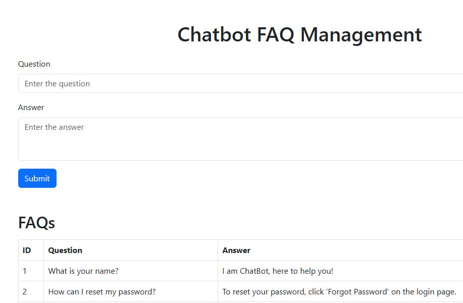

# Simple Chatbot FAQ System with MySQL

## Project Overview
This project is a **Flask-based chatbot** that provides automatic responses to frequently asked questions (FAQs) stored in a **MySQL database**. It includes endpoints for handling user queries, managing FAQs, and interacting with a front-end interface for FAQ administration.

---

## Key Features
- **Flask API for Chatbot:**
  - Handles user queries and retrieves responses from a MySQL database.
  - Allows adding and retrieving FAQs.

- **Database Management:**
  - Stores FAQs in a structured MySQL table.
  - Provides scripts for database creation and sample data insertion.

- **Front-End Interface:**
  - A simple HTML page for adding and managing FAQs dynamically.
  - Uses **Bootstrap** for styling and **Axios** for API interaction.

- **Testing via CLI:**
  - Supports API testing using **cURL** and **PowerShell**.

---

## Project Structure
```
Chatbot_FAQ_System/
├── flash_chatbot.py            # Main Flask application for chatbot functionality
├── create_database.py          # Script to create and set up the MySQL database
├── insert_sample_data.py       # Script to insert sample FAQs into the database
├── create_questions_and_answers.html  # Front-end UI for FAQ management
├── chat_test.txt               # Example API requests using PowerShell and cURL
```

---

## Requirements
- **Python 3.x**
- **MySQL Database**
- **Flask and Dependencies**

Install required dependencies using:
```bash
pip install flask mysql-connector-python flask-cors
```

---

## Setup Instructions
### **1. Set Up the Database**
Run the database setup script:
```bash
python create_database.py
```

Insert sample FAQs:
```bash
python insert_sample_data.py
```

### **2. Start the Flask Server**
Run the chatbot API:
```bash
python flash_chatbot.py
```

This will start the server on **http://127.0.0.1:5000/**

### **3. Access the FAQ Management Page**
Open `create_questions_and_answers.html` in a web browser to add and view FAQs.

---

## API Endpoints
### **1. Chat with the Bot**
Send a **POST** request with a question:
```bash
curl -X POST -H "Content-Type: application/json" -d '{"question": "What is your name?"}' http://127.0.0.1:5000/chat
```
Response:
```json
{"answer": "I am ChatBot, here to help you!"}
```

### **2. Get All FAQs**
Retrieve all stored FAQs from the DB:
```bash
curl -X GET http://127.0.0.1:5000/faqs
```

### **3. Add a New FAQ**
Send a **POST** request to add a new FAQ with Answers:
```bash
curl -X POST -H "Content-Type: application/json" -d '{"question": "How do I change my email?", "answer": "Go to settings and update your email."}' http://127.0.0.1:5000/add_faq
```

---

## Example Output
- **Web Page:**
  - Displays an interface to add and manage FAQs.
  - Uses an interactive table to list stored FAQs.
  
  

  
  
- **Command Line API Test:**
  ```
  Connecting to MySQL database...
  Flask server running at http://127.0.0.1:5000
  User question: "What is your name?"
  Response: "I am ChatBot, here to help you!"
  ```

---

## Notes
- Ensure the MySQL database service is running before starting the Flask app.
- Modify `db_config` in `flash_chatbot.py` and `create_database.py` to match your MySQL credentials.
- If hosting online, configure **CORS** settings properly.

---
